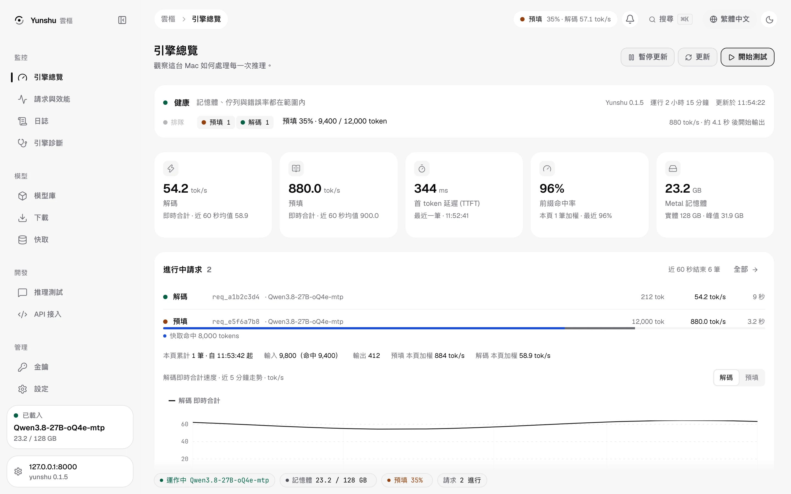
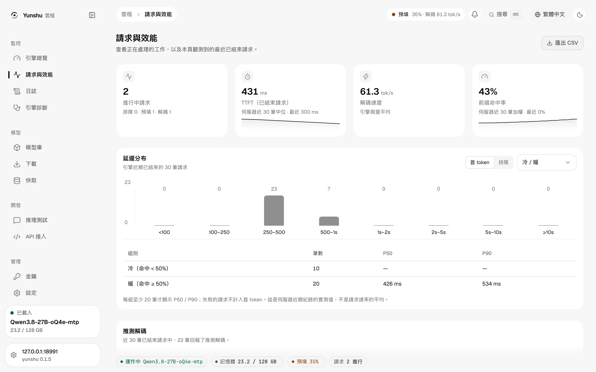
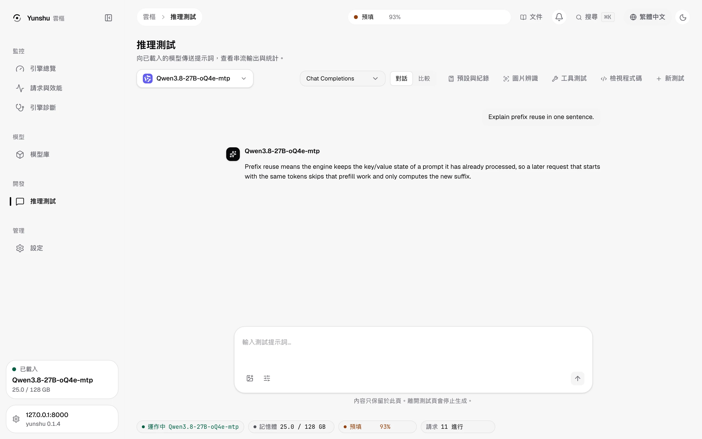
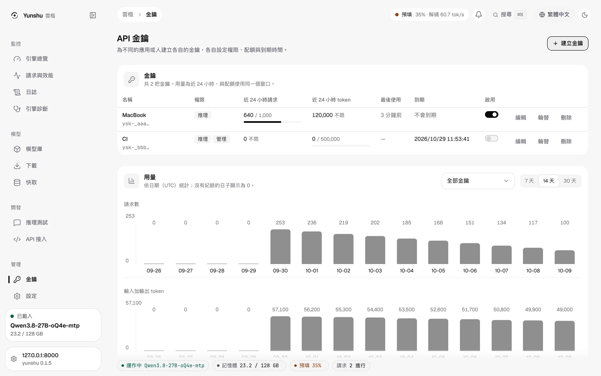
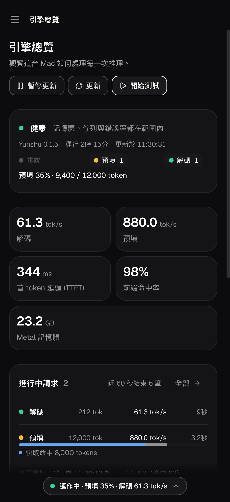

<div align="center">

# Yunshu

**為 Apple Silicon 打造的快速本地 LLM / VLM 推論引擎。**

單一進程，相容 OpenAI 與 Anthropic API，透過 MLX 在裝置端執行。為單台 Mac 的低延遲而設計：
首字快、無損解碼快，並重用已經算過的前綴。第一個完整調校的模型是 **Qwen3.8-27B**。

[](https://www.python.org/downloads/)
[](LICENSE)
[](https://github.com/YuhuanStudio/Yunshu/actions/workflows/ci.yml)

[English](README.md) · [简体中文](README.zh-CN.md) · **繁體中文**

</div>

---

<picture>
  <source media="(prefers-color-scheme: dark)" srcset="docs/images/console/zh-TW/overview-dark.webp">
  
</picture>


## 亮點

- **無損推測解碼**：DFlash2 或 MTP 草稿，搭配不隨批次改變的 kernel，開啟推測解碼時的貪婪輸出
  與關閉時逐 token 相同。
- **混合模型的前綴快取**：為 attention + GatedDeltaNet 模型保存精確 checkpoint，放在 RAM 與 SSD，
  重開後仍在；可再加儲存層。
- **快速路徑上的完整 API**：工具呼叫、JSON schema、停止序列、logprobs、推理、取消，涵蓋 OpenAI
  Chat / Responses、Anthropic Messages 與 Ollama。
- **型別化決策**：`/v1/decisions` 用決策 checkpoint 一次前向傳遞回答是非、選擇與分級問題，
  附校準過的機率，不生成文字。
- **原生支援程式碼 agent**：Claude Code、Codex、opencode 透過各自的 API 運作，含伺服器端網頁
  搜尋／抓取與 MCP。
- **預設無損**：任何可能改變輸出的東西都是要自己開的設定。
- **本地且私密**：不傳送使用統計；診斷資料不含 prompt。
- **完整的 console**：本地網頁 console，有即時請求階段（排隊、含快取命中區段的 prefill、decode）、請求歷史、
  日誌、模型、快取、推理測試、含每把金鑰配額的 API 金鑰、設定（含 CORS 編輯器）與主機功耗／時脈／溫度，
  另有浮動的狀態島。[Console 說明](docs/CONSOLE.md)。
- **帶引用的網頁搜尋**：伺服器端 `web_search` / `web_fetch`，供 Claude Code、Codex 與各 API 使用；六個來源
  （DuckDuckGo、Wikipedia、SearXNG、Tavily、Serper、Perplexity）、Tavily 相容 API 與可選的研究加強。[說明](docs/guides/WEB_SEARCH.md)。
- **Evals 與已儲存的 completions**：`store: true` 在本機保存 chat completions，OpenAI Evals API 以本機評分器評分。[說明](docs/guides/EVALS.md)。
- **主機遙測**：功耗、GPU 時脈、溫度、散熱與記憶體壓力，以及每個請求的能耗估計，免特權且只在本機。[說明](docs/guides/TELEMETRY.md)。
- **多把 API 金鑰**：每把有權限、到期與每日配額。[說明](docs/guides/AUTH_AND_KEYS.md)。

## 能力總覽

Yunshu 提供的所有能力，分組列出。每一列連到有範例與限制的說明；部分支援或實驗中的項目都會標明。同一份清單也以機器可讀形式放在 [`docs/feature_index.json`](docs/feature_index.json)。

**推論**

| 能力 | 內容 |
|---|---|
| [無損推測解碼](docs/guides/INFERENCE.md) | DFlash2、MTP 與 prompt-copy 草稿，搭配批次不變 kernel；貪婪輸出與關閉推測時相同 |
| [文字模型推測](docs/guides/INFERENCE.md) | mlx-lm 模型的 n-gram / suffix 與 Gemma 4 assistant 草稿（外部草稿模型仍為實驗） |
| [前綴快取（APC）](docs/guides/KV_CACHE_MATRIX.md) | 混合模型的精確 checkpoint，位於 RAM、SSD 與可選儲存層；圖片與音訊鍵 |
| [結構化輸出](docs/guides/INFERENCE.md) | JSON schema、regex、選項與文法在解碼時強制，含工具參數 |
| [有損記憶體選項](docs/guides/INFERENCE.md) | int8 KV、壓縮 WARM 層與載入時量化；預設關閉 |
| [大型 MoE 載入（部分）](docs/guides/INFERENCE.md) | 社群 DeepSeek-V4-Flash 權重包的位元與 group size 由張量形狀推得；載入前有容納檢查 |
| [Round driver（實驗）](docs/guides/ROUND_DRIVER.md) | 稠密 Qwen3.5 系列模型的自有推測回合驅動 |
| [模型支援](docs/guides/MODEL_SUPPORT.md) | 各系列哪些是調校、通用與已驗證 |

**API**

| 能力 | 內容 |
|---|---|
| [OpenAI API](docs/guides/API_SURFACE.md) | Chat、Completions、Responses（HTTP 與 WebSocket）、Embeddings、Models、Files、Batches、Conversations |
| [Anthropic API](docs/guides/API_SURFACE.md) | Messages、count_tokens、batches、thinking、工具、cache_control、文件與引用 |
| [Ollama API](docs/guides/API_SURFACE.md) | /api/chat、/api/generate 與原生模型管理（pull、copy、delete、show） |
| [Responses 延伸](docs/guides/API_SURFACE.md) | 用戶端執行的 computer 工具、conversations、壓縮、previous_response_id |
| [已儲存的 chat completions](docs/guides/API_SURFACE.md) | store: true 後可列出、取得、更新、刪除並列出訊息 |
| [Evals](docs/guides/EVALS.md) | OpenAI Evals API，含字串比對、相似度與本機模型評分器 |
| [型別化決策](docs/guides/DECISIONS.md) | 一次前向傳遞給出是非、選擇與分數答案及機率，不生成文字 |
| [Batches、Files 與 tokenizer](docs/guides/API_SURFACE.md) | OpenAI 與 Anthropic batches、Files API、tokenize / detokenize / apply-template / props |
| [傳輸方式](docs/guides/TRANSPORTS.md) | SSE、WebSocket 串流、Unix socket、HTTP/2、可選 WebRTC |
| [Yunshu 延伸](docs/guides/API_EXTENSIONS.md) | 請求 id、即時階段、prefill 進度、取消、期限、x_yunshu 統計、warmup、記憶體單位 |
| [Prompt caching API](docs/guides/PROMPT_CACHING_APIS.md) | 三種方言的 cache_control 與快取 token 計數 |

**Agent 與工具**

| 能力 | 內容 |
|---|---|
| [程式碼 agent](docs/guides/AGENT_COMPAT.md) | Claude Code、Codex、opencode 透過各自的 API 運作；`yunshu launch` |
| [網頁搜尋與擷取](docs/guides/WEB_SEARCH.md) | 伺服器端 web_search / web_fetch 與引用；DuckDuckGo、Wikipedia、SearXNG、Tavily、Serper、Perplexity |
| [Tavily 相容 API](docs/guides/TAVILY.md) | search、extract、crawl、map、research 與 MCP，含 provider 健康退避 |
| [MCP](docs/guides/API_SURFACE.md) | 原生 MCP 端點，以及請求中指定的遠端 MCP server |
| [用戶端設定](docs/guides/CLIENTS.md) | curl、OpenAI 與 Anthropic SDK、Open WebUI |

**多模態**

| 能力 | 內容 |
|---|---|
| [圖片、音訊與影片輸入](docs/guides/MULTIMODAL.md) | mlx-vlm 模型在 Chat、Responses、Messages 接受媒體；媒體進入快取鍵 |
| [語音對語音（部分）](docs/guides/MULTIMODAL.md) | Qwen3-Omni 原生語音；重複圖片尚未命中快取 |
| [Realtime 語音](docs/guides/MULTIMODAL.md) | WebSocket 與可選 WebRTC、伺服器 VAD、打斷、短期 client secret、本機聲音 |
| [語音轉文字與文字轉語音](docs/guides/MULTIMODAL.md) | transcriptions、translations、speech 與 voices |
| [OCR 與圖像生成](docs/guides/MULTIMODAL.md) | GLM-OCR 文字擷取；圖像 generations、edits、variations |
| [Embeddings、rerank、score、classify](docs/guides/MULTIMODAL.md) | 文字與多模態 embeddings、cross-encoder rerank、訓練過的分類頭 |

**營運與 console**

| 能力 | 內容 |
|---|---|
| [網頁 console](docs/CONSOLE.md) | 即時請求階段、歷史、日誌、模型、下載、快取、測試、金鑰、設定、狀態島 |
| [API 金鑰與配額](docs/guides/AUTH_AND_KEYS.md) | 多把金鑰，含權限、到期、每鑰用量與每日配額 |
| [設定寫入與 CORS 編輯](docs/guides/AUTH_AND_KEYS.md) | 從 console 或 API 寫入引擎設定（需重啟者會提示）並編輯 CORS |
| [主機遙測](docs/guides/TELEMETRY.md) | 功耗、GPU 時脈、溫度、散熱與記憶體壓力、每請求能耗估計、Prometheus |
| [命令列](docs/guides/CLI.md) | setup、doctor、models list/pull/rm/show、top、service、補全與推論指令 |
| [登入服務](docs/guides/SERVICE.md) | launchd agent、重啟與日誌 |
| [設定](docs/CONFIGURATION.md) | 單一設定登錄表：環境變數、TOML 檔或 `--set` |
| [安全](docs/guides/AUTH_AND_KEYS.md) | 驗證 token、CORS 憑證規則、轉址時移除標頭、機密遮蔽、SSRF 防護 |
| [首次執行與疑難排解](docs/guides/FIRST_RUN.md) | 安裝、選擇模型、就緒檢查與修復 |
| [效能基準與準確度](docs/BENCHMARKS.md) | 每個數字的來源、重現方式與準確度檢查 |

## 快速開始

模型選擇、外接儲存、就緒檢查與升級請參閱[首次使用指南](docs/guides/FIRST_RUN.md)。

需要 Apple Silicon、macOS 14 以上、Python 3.13 以上與 [uv](https://docs.astral.sh/uv/)。

```bash
uv tool install --python 3.13 "yunshu[vision]"      # or: brew install yuhuanstudio/tap/yunshu
yunshu doctor                                   # checks this Mac and says how to fix problems
yunshu pull mlx-community/Qwen3.5-9B-MLX-4bit
yunshu serve -m mlx-community/Qwen3.5-9B-MLX-4bit
```

伺服器在 `http://127.0.0.1:8000`。任何 OpenAI 或 Anthropic 客戶端都能直接使用：

```python
from openai import OpenAI

client = OpenAI(base_url="http://127.0.0.1:8000/v1", api_key="local")  # any key works
r = client.chat.completions.create(
    model="local",
    messages=[{"role": "user", "content": "Explain MLX in one sentence."}],
)
print(r.choices[0].message.content)
```

```python
from anthropic import Anthropic

client = Anthropic(base_url="http://127.0.0.1:8000", api_key="local")
msg = client.messages.create(
    model="local", max_tokens=512,
    messages=[{"role": "user", "content": "Explain MLX in one sentence."}],
)
print(msg.content[0].text)
```

模型放在 `~/.yunshu/models`（`yunshu config set models_dir PATH` 指定後續下載目錄，不搬動現有權重）；`serve -m org/name`
也會找 Hugging Face 快取，只有需要時才下載。`yunshu service install -m <model>` 讓伺服器在登入時啟動。

### 本地 console

位於 `/console/` 的本地網頁 console 顯示引擎正在做什麼並可管理它，支援英文、繁體中文與簡體中文。
它由原始碼編譯（如下），並由同一個行程提供：

```bash
cd frontend && pnpm install --frozen-lockfile && pnpm build && cd ..
yunshu serve -m <model>
open http://127.0.0.1:8000/console/
```

- **總覽**：即時請求階段、prefill 與 decode tok/s、prefill 條內的前綴快取命中區段、首 token 延遲、Metal 記憶體、
  主機功耗、時脈與溫度。
- **請求**與**日誌**：延遲分布（冷／暖）、推測接受率、請求歷史、取消；已遮蔽憑證的即時日誌，可搜尋與下載。
- **診斷**：資源讀數、健康檢查、Realtime 連線測試與支援包。
- **模型**、**下載**、**快取**：載入、卸載、預熱與容納檢查；從 Hugging Face 下載並顯示進度；檢視或清除
  RAM／WARM／SSD 前綴快取層。
- **推理測試**與 **API 接入**：串流對話（含推理）、比較、檢視程式碼；Claude Code、Codex、opencode、SDK 與 curl 的可貼上設定。
- **金鑰**與**設定**：含配額與用量的 API 金鑰、所有引擎設定（需重啟者會提示）與 CORS 編輯器。
- 浮動的**狀態島**跟著你切換頁面，版面也適用於手機。

<picture>
  <source media="(prefers-color-scheme: dark)" srcset="docs/images/console/zh-TW/requests-dark.webp">
  
</picture>

<picture>
  <source media="(prefers-color-scheme: dark)" srcset="docs/images/console/zh-TW/playground-dark.webp">
  
</picture>

<picture>
  <source media="(prefers-color-scheme: dark)" srcset="docs/images/console/zh-TW/keys-dark.webp">
  
</picture>



含截圖的逐頁導覽：[Console 說明](docs/CONSOLE.md)。

### Qwen3.8-27B

```bash
yunshu pull Jundot/Qwen3.8-27B-oQ4e-mtp
yunshu pull incoai/Qwen3.8-27B-DFlash2          # optional drafter, picked up automatically
yunshu serve -m Jundot/Qwen3.8-27B-oQ4e-mtp
```

裝好草稿模型後，啟動日誌會顯示 `Speculative decoding: dflash`；沒裝時由模型自帶的 MTP 頭產生草稿。
`yunshu doctor -m <model>` 會回報選用的路徑，以及這台 Mac 的記憶體是否放得下。

### 從原始碼執行

```bash
git clone https://github.com/YuhuanStudio/Yunshu.git && cd Yunshu
uv sync --extra vision
uv run yunshu serve -m <model>
```

## 運作方式

```
 OpenAI / Anthropic / Ollama clients ──► FastAPI gateway (one process)
                                           │  request validation, tool/reasoning parsing,
                                           │  server-side tools (web search / fetch / MCP)
                                           ▼
                                  engine (one MLX thread)
          ┌────────────────────────────────┴───────────────────────────────┐
   VLM batch runner (every mlx-vlm model)                 text fast path (mlx-lm models)
   shared continuous batch, per-row sampling              single-request generate_step
   speculative lane: DFlash2 / MTP / prompt-copy
   prefix cache: RAM ─► SSD ─► optional storage tiers
```

所有 GPU 工作都在同一條 MLX 執行緒上，請求之間不會互搶 GPU。每個回應在自己的生成結束時就回傳。

### 推測解碼

Qwen3.5 家族的單一請求在推測解碼通道中解碼：

- **DFlash2**：獨立的區塊草稿模型，每輪提出多個 token；裝了相符的草稿模型就自動使用。
- **MTP**：checkpoint 自帶的多 token 預測頭；沒有草稿模型時的後備。
- **Prompt-copy 草稿**：當輸出開始重複 prompt 裡的文字（改程式碼、引用工具結果、多輪 agent），
  通道會提出那段文字的後續，並在同一次驗證中檢查。預設開啟（`YUNSHU_SPEC_COPY_ROWS`，設 `0` 關閉）。

所有解碼與驗證的矩陣乘法都走**不隨批次改變的 kernel**：一個 token 不論單獨驗證或和其他列一起驗證，
算術都相同。這讓開關推測解碼時的貪婪輸出完全一致，取樣輸出在依位置決定的取樣下也精確一致。
用 `YUNSHU_VLM_DRAFT` 選擇草稿（`mtp`、`off` 或草稿模型路徑）。

### 前綴快取（APC）

Qwen3.5 家族混合了 attention 層與遞迴的 GatedDeltaNet 層。遞迴狀態不能像 KV 快取那樣切回較早的
token，所以一般的前綴快取無法使用。Yunshu 在前綴邊界保存**精確的 checkpoint**（KV 加遞迴狀態），
以文字 token 及圖片像素／音訊特徵為鍵，所以快取命中的結果和冷預填完全相同。

| 層 | 位置 | 預設 |
|---|---|---|
| HOT | RAM 中可直接使用的陣列 | 開啟，依可用記憶體決定大小（`YUNSHU_VLM_APC_MEMORY_GB`） |
| WARM | RAM 中壓縮存放（無損 zstd，或有損 int8 / int4） | 關閉（`YUNSHU_VLM_APC_WARM`） |
| SSD | `~/.yunshu/cache/apc`，一個全域磁碟預算並保留剩餘空間，重開後仍在 | 開啟（`YUNSHU_VLM_APC_DISK`、`_DIR`、`_GB`） |
| 儲存層 | 外接 SSD、HDD、NAS（`YUNSHU_VLM_APC_DISK_TIERS`） | 關閉；會量測每個磁碟的速度，只有還原比重算快時才使用 |

重複或修改過的長 prompt、多輪對話與 agent 迴圈，會從最近的 checkpoint 還原，不必重新預填。
對話變長時，同一段對話較舊的 checkpoint 會被取代，不會越堆越多。`yunshu cache status` 與
`yunshu cache gc` 可檢視與清理 SSD 快取。

### 結構化輸出

JSON schema、JSON object、regex 與 grammar 約束在解碼時強制執行（預設使用 llguidance），也包括
工具呼叫的參數。不支援的 schema 寫法會明確回錯，而不是默默忽略。

## API 相容性

| API | 路由 |
|---|---|
| OpenAI | `/v1/chat/completions`、`/v1/completions`、`/v1/responses`（HTTP 與 WebSocket）、`/v1/embeddings`、`/v1/models`、`/v1/audio/*`、`/v1/images/*`、`/v1/realtime`、`/v1/files`、`/v1/batches` |
| Anthropic | `/v1/messages`（thinking、tools、`cache_control`、伺服器工具 `web_search` / `web_fetch`、`mcp_servers`）、`/v1/messages/count_tokens`、`/v1/messages/batches`、Files |
| Ollama | `/api/chat`、`/api/generate` 與模型相關路由 |
| Yunshu 擴充 | 請求即時階段（`/v1/requests`）、以請求 id 取消、預熱、截止時間、佇列標頭、串流中的預填進度、`/v1/yunshu/status` |

Chat 支援的參數：`tools` / `tool_choice` / `parallel_tool_calls`、`response_format`（`json_object`、
strict `json_schema`）、`stop`、`logprobs` / `top_logprobs`（串流也有）、`n`、`seed`、penalty、
`logit_bias`、`reasoning_effort`（推理內容另外回傳）、含 usage 的串流，以及 `usage` 中的快取 token 數。
錯誤使用各 API 自己的格式。擴充欄位都有命名空間（`x_yunshu`、`X-Yunshu-*`），官方 SDK 會忽略。
完整矩陣與每一列的驗證方式見 [API surface](docs/guides/API_SURFACE.md)。

### 型別化決策

`POST /v1/decisions`（以及 System One 格式 `/v1/systemone`）讓決策 checkpoint 針對文字或圖片回答
是非（predicate）、選擇（choice）與分級（score）問題。一次前向傳遞就回傳帶機率的型別化答案，
不生成任何 token；數值異常時回傳拒答，絕不捏造機率。目前支援 Cloudflare Clef / Clef-flash 的 MLX
checkpoint；OpenJev、Laya、D1 等其他決策頭尚未支援。

```python
decision = client.decisions.create(
    model="abenzerps/Clef-MLX",
    input="The customer asks for a refund after a broken delivery.",
    questions=[{"type": "choice", "name": "route", "instructions": "Choose the support team.",
                "choices": [{"value": "support"}, {"value": "sales"}]}],
)
print(decision.answers)  # typed value, confidence, every option's probability
```

0.1.5 在 main 上另外新增：儲存聊天回應、Evals（`/v1/evals`）與 Realtime client secrets。

[決策](docs/guides/DECISIONS.md)、[Evals](docs/guides/EVALS.md)、[網頁搜尋](docs/guides/WEB_SEARCH.md)與 [Tavily API](docs/guides/TAVILY.md)

## 程式碼 agent

```bash
yunshu launch claude      # or: codex, opencode
```

`yunshu launch` 會寫好客戶端設定（base URL、模型、上下文長度與輸出上限、reasoning effort）並啟動
agent。對 Claude Code 還會裝上狀態列，即時顯示預填進度、解碼速度與快取命中。

- **Claude Code**：Messages API，含串流、thinking、`/context` 用的 `count_tokens`、模型探索，以及由
  Yunshu 在伺服器端執行的 WebSearch 工具。
- **Codex**：Responses API，含推理項目、function call、本地壓縮與 `web_search`。
- **opencode**：Chat Completions，含工具與 usage。

伺服器端搜尋預設以 best-effort DuckDuckGo HTML、Wikipedia 與已設定的 keyed providers 並行查詢；查詢會離開本機。`YUNSHU_WEB_SEARCH_PROVIDER=none` 可停用。SearXNG 為選用；請求指定的 MCP 伺服器由 gateway 連線。
各 agent 實際呼叫了什麼、怎麼驗證的，見 [Agent 相容性](docs/guides/AGENT_COMPAT.md)。

## 效能

Qwen3.8-27B（oQ4e），M5 Max 128 GB，單一請求，貪婪解碼。方法、原始結果與完整比較表在
[docs/BENCHMARKS.md](docs/BENCHMARKS.md)。

| | Yunshu | TensorFold 0.6.1 |
|---|---|---|
| 冷啟動首字延遲，8K prompt | 8.6 秒 | 8.5 秒 |
| 冷啟動首字延遲，32K prompt | 38.3 秒 | 39.4 秒 |
| 重複或修改過的長 prompt | 從前綴快取還原，不必重新預填 | — |
| 後續回合首字延遲，8K / 32K 程式碼 | 512 / 721 毫秒 | 505 / 670 毫秒 |
| 解碼，短程式碼 prompt | 約 110 tok/s（DFlash2） | 約 140 tok/s（DFlash2） |
| JSON schema / 工具呼叫輸出，warm | 111 / 78 tok/s（推測解碼照常啟用） | — |

2026-10-02/03 的 main 快照（v0.1.4 之後尚未發佈；表中 TensorFold 欄為 2026-10-02 同窗口量測），新的 0.1.4 同窗口比較待測。
目前 TensorFold 的單請求解碼與 32K 後續回合仍較快，縮小這些差距是正在進行的主要工作。結構化輸出也照常使用推測解碼（不用時為 23 tok/s）。推測解碼永遠不會改變
Yunshu 的貪婪輸出。相對於原版 MLX 路徑的準確度，分三個層次檢查（logit 對齊、貪婪分歧、成對下游評測），
見 [準確度](docs/guides/ACCURACY.md)。

## 模型

| 模型 | 服務路徑 |
|---|---|
| Qwen3.5 / 3.6 / 3.8 家族（優先調校 Qwen3.8-27B） | VLM batch runner，含前綴快取與 MTP / DFlash2 推測解碼 |
| 其他 mlx-vlm 模型（Gemma、GLM、Qwen-VL、Qwen-Omni…） | 同一個 runner；模型支援時可輸入圖片、音訊、影片；快取版面允許時使用前綴快取 |
| 純文字 mlx-lm 模型 | 單請求快速路徑，含約束、工具與 logprobs |

`/v1/models` 會回傳每個模型的資訊卡：上下文長度、輸出上限，以及實際支援哪些輸入與功能。

## 其他能力

| 能力 | 端點 | Extra |
|---|---|---|
| Qwen3-Omni 語音對語音 | `/v1/omni/speech/stream`（[範例](examples/talk.py)） | `omni` |
| Realtime 語音、ASR、TTS | `/v1/realtime`、`/v1/audio/transcriptions`、`/v1/audio/speech` | `audio` |
| OCR | `/v1/ocr`（GLM-OCR） | `vision` |
| 圖片生成與編輯 | `/v1/images/generations`、`/v1/images/edits` | `generation` |
| Embeddings、rerank、相似度 | `/v1/embeddings`、`/v1/rerank`、`/v1/score` | `embeddings` |

## 命令列

| 指令 | 用途 |
|---|---|
| `yunshu doctor` | 檢查這台 Mac、相依套件與模型，並說明怎麼修 |
| `yunshu pull` / `yunshu model` | 下載與管理模型 |
| `yunshu serve` / `yunshu service` | 執行伺服器，或安裝成登入時啟動的服務 |
| `yunshu launch` / `yunshu statusline` | 啟動接好 Yunshu 的程式碼 agent；引擎即時狀態列 |
| `yunshu chat`、`complete`、`embed`、`transcribe`、`speak`、`ocr`、`image` | 在終端機使用執行中的伺服器 |
| `yunshu status`、`cancel` | 伺服器狀態、取消進行中的請求 |
| `yunshu top` | （0.1.5）即時檢視伺服器健康、記憶體、引擎與模型（`--json` 輸出單次快照） |
| `yunshu config` | 實際生效的設定與來源 |
| `yunshu cache status` / `gc` | 檢視與清理 SSD 前綴快取 |
| `yunshu bench`、`eval`、`diagnose` | 效能測試、準確度評測、系統診斷 |

每個指令都有 `--help`。

## 設定

所有設定都走同一個註冊表：環境變數、TOML 檔（`yunshu serve --config yunshu.toml`）或
`--set KEY=VALUE`。`yunshu config` 會顯示實際生效的值與來源。常用的：

| 設定 | 用途 |
|---|---|
| `YUNSHU_VLM_DRAFT` | 草稿選擇：`mtp`、`off` 或草稿模型路徑 |
| `YUNSHU_SPEC_COPY_ROWS` | prompt-copy 草稿寬度（`0` = 關閉） |
| `YUNSHU_VLM_APC_MEMORY_GB`、`YUNSHU_VLM_APC_DISK_GB`、`YUNSHU_VLM_APC_DISK_DIR` | 前綴快取的 RAM、SSD 預算與位置 |
| `YUNSHU_VLM_APC_DISK_TIERS` | 額外的儲存層，例如 `/Volumes/Ext/apc@200,/Volumes/NAS/apc` |
| `YUNSHU_VLM_APC_WARM`、`YUNSHU_KV_PRECISION` | 有損的省記憶體選項（預設關閉） |
| `YUNSHU_AUTH_TOKEN`、`YUNSHU_QUEUE_LIMIT` | API key 與請求佇列上限 |

所有設定見 [設定](docs/CONFIGURATION.md)。

## 文件

- [Console](docs/CONSOLE.md)：每個頁面與截圖；[CLI](docs/guides/CLI.md)：首次啟動、模型、launchd、JSON 與 shell completion
- [推論功能](docs/guides/INFERENCE.md)、[多模態端點](docs/guides/MULTIMODAL.md)、[模型支援](docs/guides/MODEL_SUPPORT.md)
- [客戶端](docs/guides/CLIENTS.md)：curl、OpenAI / Anthropic SDK、Open WebUI、agent
- [API surface](docs/guides/API_SURFACE.md)、[API 延伸](docs/guides/API_EXTENSIONS.md)、[API 參考](docs/API.md)、[傳輸方式](docs/guides/TRANSPORTS.md)
- [決策](docs/guides/DECISIONS.md)、[Evals](docs/guides/EVALS.md)、[網頁搜尋](docs/guides/WEB_SEARCH.md)、[Tavily API](docs/guides/TAVILY.md)
- [Agent 相容性](docs/guides/AGENT_COMPAT.md)
- [驗證、金鑰、設定與 CORS](docs/guides/AUTH_AND_KEYS.md)、[遙測](docs/guides/TELEMETRY.md)
- [KV 快取分層](docs/guides/KV_CACHE_MATRIX.md) 與 [prompt caching API](docs/guides/PROMPT_CACHING_APIS.md)
- [效能測試](docs/BENCHMARKS.md) 與 [準確度](docs/guides/ACCURACY.md)
- [首次執行](docs/guides/FIRST_RUN.md)、[背景服務](docs/guides/SERVICE.md)、[疑難排解](docs/guides/TROUBLESHOOTING.md)、[設定](docs/CONFIGURATION.md)、[變更紀錄](CHANGELOG.md)

## 隱私

不傳送使用統計或當機報告。主機遙測（功耗、溫度、記憶體）只在本機取樣供主控台使用，不會離開這台機器（[說明](docs/guides/TELEMETRY.md)）。Yunshu 只在下載模型、連到你設定的網頁搜尋／MCP 服務，以及請求
要求抓取網頁時才對外連線。

## 基礎與授權

[MLX](https://github.com/ml-explore/mlx)、[mlx-lm](https://github.com/ml-explore/mlx-lm)、
[mlx-vlm](https://github.com/Blaizzy/mlx-vlm)、[mlx-audio](https://github.com/Blaizzy/mlx-audio)。
來自 [oMLX](https://github.com/jundot/omlx) 與 [TensorFold](https://github.com/ashhart/TensorFold)
的 kernel 保留其授權聲明，見 [THIRD_PARTY_NOTICES](THIRD_PARTY_NOTICES.md)。Yunshu 採用
Apache 2.0：[LICENSE](LICENSE)。
