# Yunshu console

A local web console for the engine: see what every request is doing, manage models, the prefix cache, keys
and settings, and try a model, without leaving the browser. It is a YunUI-based single-page app served by
the same process at `/console/`. It is an operator tool for one machine, not a chat product, and it does not
start or stop the engine process.

<picture>
  <source media="(prefers-color-scheme: dark)" srcset="images/console/en/overview-dark.webp">
  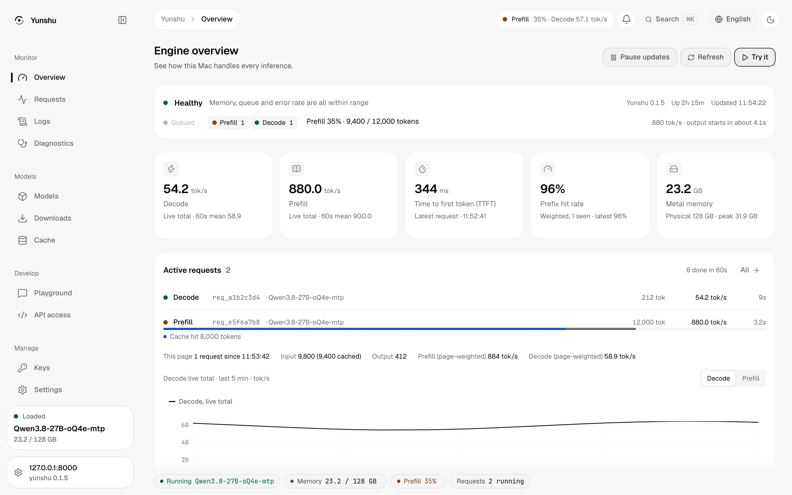
</picture>

## Open it

```bash
yunshu serve -m <model>
open http://127.0.0.1:8000/console/
```

The console ships inside the `yunshu` wheel (`yunshu_gateway/console_static/`), so a pip, uv tool or
Homebrew install serves it at `/console/` with no build step.

The static shell is public so you can enter a token; inference, model operations, keys and settings keep
their normal authorization ([Authentication](guides/AUTH_AND_KEYS.md)). If `YUNSHU_AUTH_TOKEN` is set, enter
it in Settings: it stays in page memory unless you choose to remember it on this device.

## Docs inside the console

The 文件 / Docs section renders the user documentation (getting started, API reference, guides,
developer pages) from `frontend/docs/` (MDX in English, 繁體中文 and 简体中文), compiled into the
console build, so it works offline and matches the installed version. `⌘K` searches it; the API,
Settings and Keys pages link to the page that explains them. These MDX pages are the source of
the user-facing guides; the same-named files in `docs/guides/` are their GitHub-facing counterparts
(each names its MDX page), and the configuration reference is generated from the settings registry
(`frontend/scripts/gen_docs_config.py`). Checks: `pnpm test` (links and heading anchors),
`tests/unit/test_docs_routes.py` (every route named in the docs is registered; generated pages are current).

## Status island

A floating pill at the bottom of every page shows the live engine state: running model, memory, prefill or
decode progress and active requests. Opening it shows the current phase of each request, Metal memory and
pressure, and host power, GPU clock and temperature without leaving the page you are on. On a phone it
collapses to a single compact pill.

<picture>
  <source media="(prefers-color-scheme: dark)" srcset="images/console/en/island-dark.webp">
  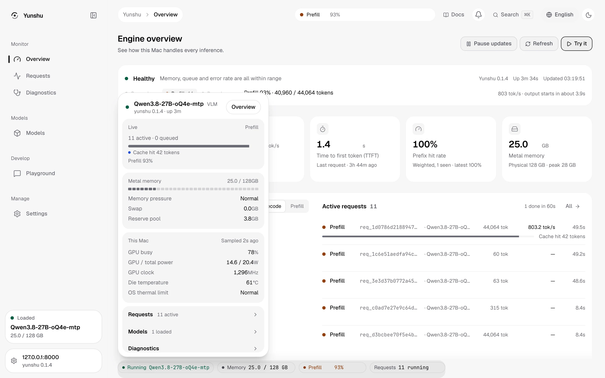
</picture>

## Pages

### Engine overview

One screen for how the Mac is handling inference right now: a health banner (memory, queue, error rate), live **request phases** (queued, prefill, decode) with a prefill progress bar whose **cache-hit segment** shows how many prompt tokens came from the prefix cache, decode and prefill tok/s, time to first token, prefix hit rate, Metal memory, and throughput charts. A host panel adds power, GPU clock and die temperature when host telemetry is available ([Telemetry](guides/TELEMETRY.md)). It samples every few seconds while the page is visible; Pause and Refresh are in the header.

<picture>
  <source media="(prefers-color-scheme: dark)" srcset="images/console/en/overview-dark.webp">
  
</picture>

### Requests and performance

Live and recently finished requests: latency distribution (time to first token or queue time, cold versus warm by cache hit), P50/P90 per group, speculative-decode acceptance by draft depth, per-request detail and cancel, request history read from the metadata-only serve log (no prompts), and CSV export. Failed requests are not counted in first-token latency.

<picture>
  <source media="(prefers-color-scheme: dark)" srcset="images/console/en/requests-dark.webp">
  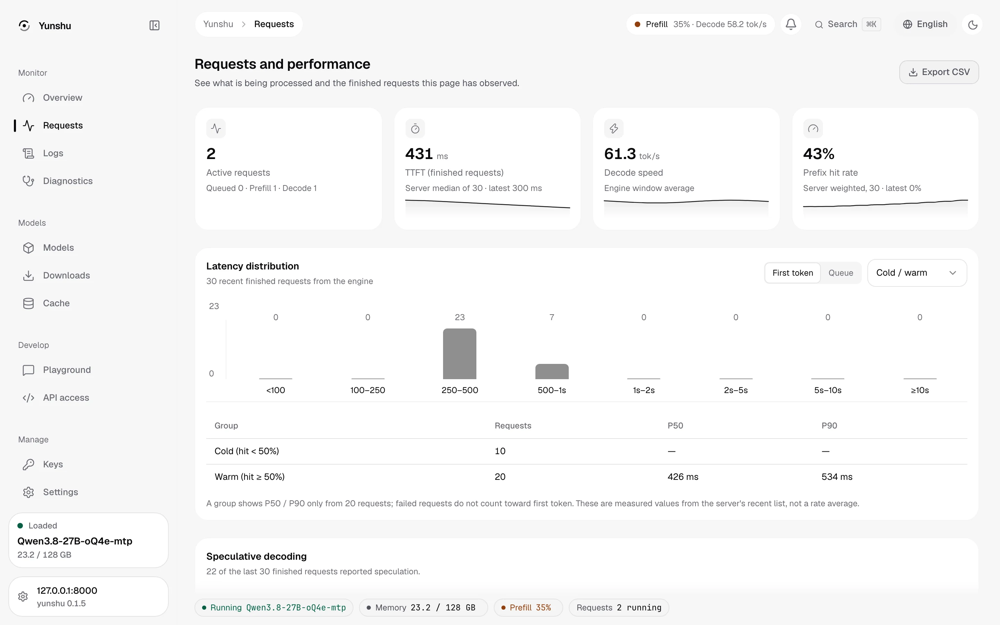
</picture>

### Logs

The engine's in-memory log ring (2,000 records, credentials already redacted when emitted): level filter, text search, follow/pause, and copy or download of the visible lines. The buffer is cleared on restart.

<picture>
  <source media="(prefers-color-scheme: dark)" srcset="images/console/en/logs-dark.webp">
  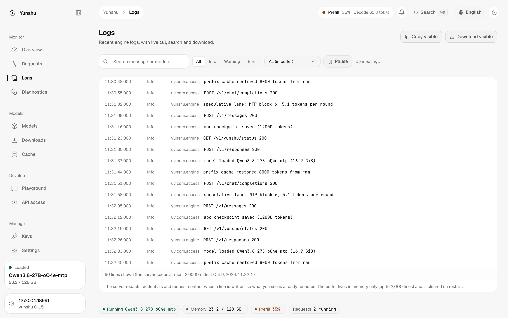
</picture>

### Engine diagnostics

Resource readouts (CPU, unified memory, Metal), health checks derived from real responses, a Realtime connection probe (browser to engine WebSocket, no audio, no GPU), a preview of the support bundle, and copy or download of the diagnostics bundle (`GET /v1/yunshu/bundle`; nothing is uploaded and it never contains prompts).

<picture>
  <source media="(prefers-color-scheme: dark)" srcset="images/console/en/diagnostics-dark.webp">
  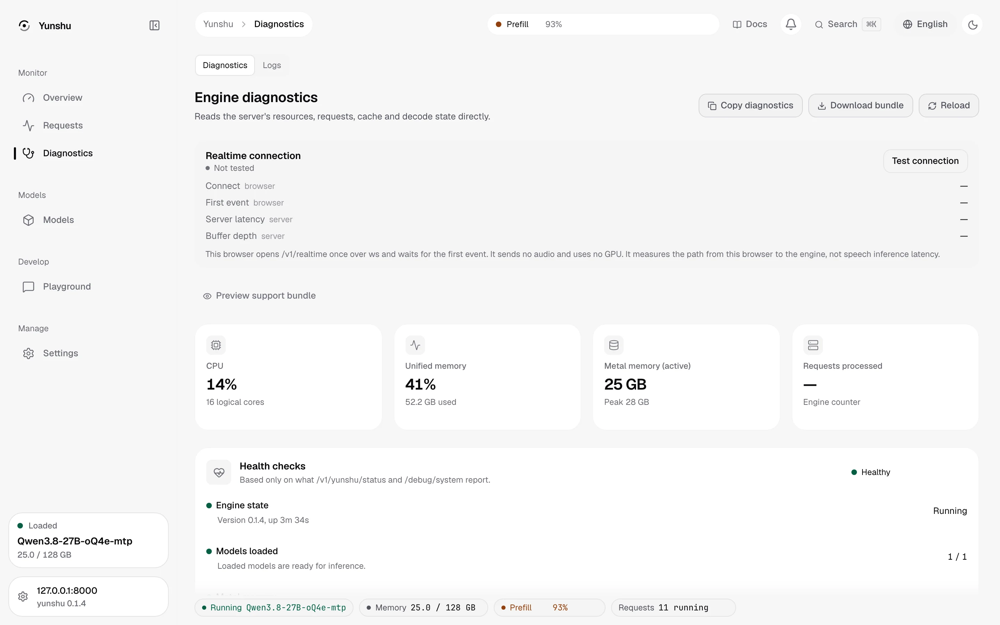
</picture>

### Models

Registered and loaded models with state, size and idle retention; load, unload, warm up and test in the playground; a fit check that says whether a model fits and what would be evicted; import a local or Hugging Face snapshot without copying weights; models found on disk but not registered; cancel an in-progress load.

<picture>
  <source media="(prefers-color-scheme: dark)" srcset="images/console/en/models-dark.webp">
  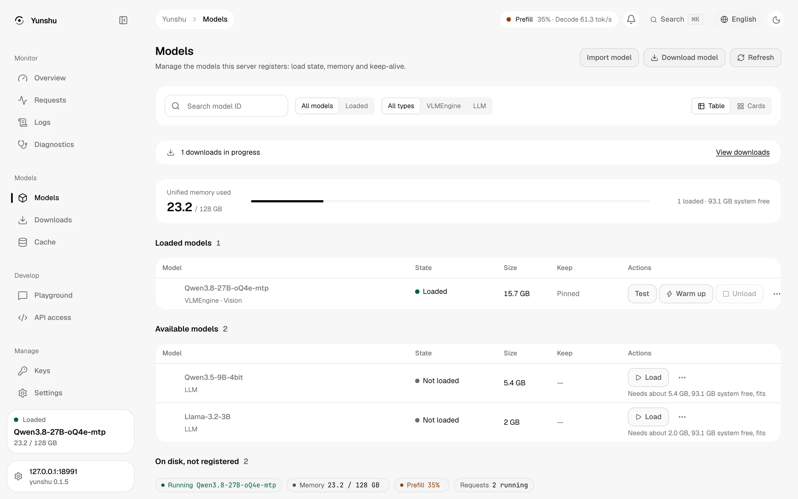
</picture>

### Downloads

Pull a Hugging Face repository (optional revision and file patterns) with progress, rate, ETA, cancel and resume, and free-space display. Finished downloads are registered and appear under Models.

<picture>
  <source media="(prefers-color-scheme: dark)" srcset="images/console/en/downloads-dark.webp">
  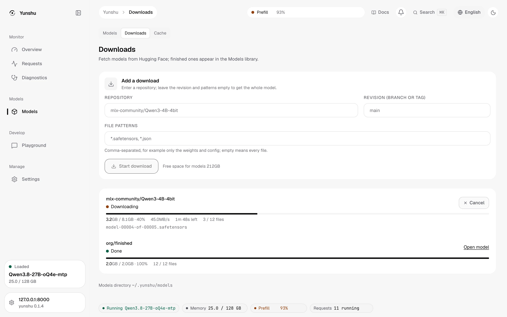
</picture>

### Cache

Prefix cache (APC) per model: usage and cap of the RAM, WARM and SSD tiers, entries, hit rate by tier, the largest entries, and clear by tier. Clear is refused while a request is running.

<picture>
  <source media="(prefers-color-scheme: dark)" srcset="images/console/en/cache-dark.webp">
  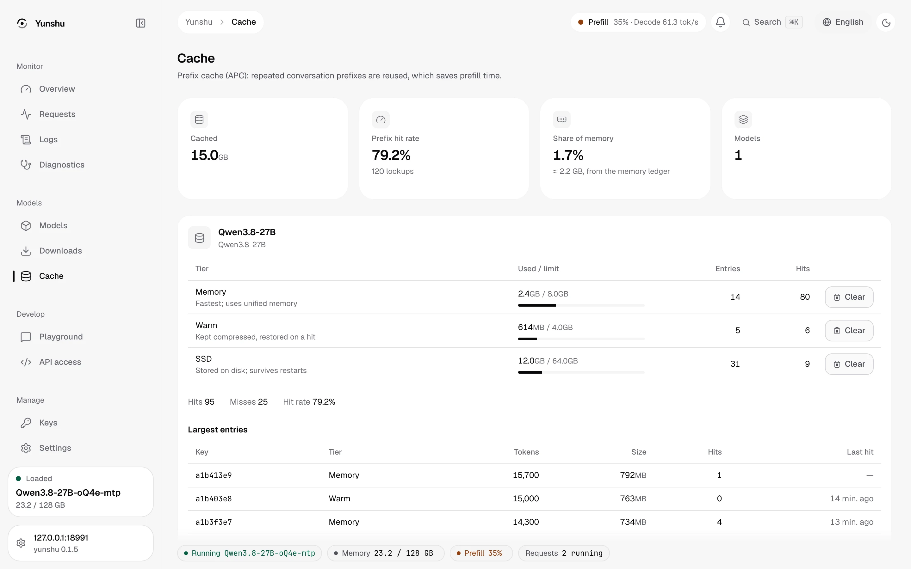
</picture>

### Playground

Chat against the loaded model over real SSE streaming with reasoning shown separately, side-by-side compare, saved presets, image input for vision models, a tool-call tester, per-token confidence (logprobs) and a view-code panel that emits the same request as curl or SDK code.

<picture>
  <source media="(prefers-color-scheme: dark)" srcset="images/console/en/playground-dark.webp">
  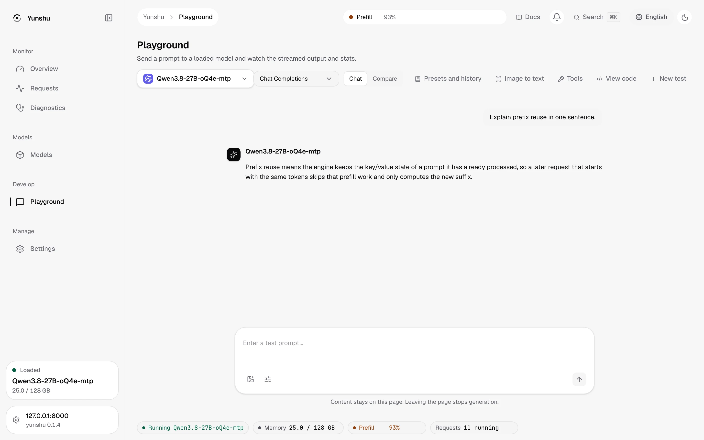
</picture>

### API access

Base URLs for the OpenAI and Anthropic dialects and ready-to-paste setup for Claude Code, Codex, opencode, the SDKs and curl, generated for the selected model. The same wiring is available from the terminal with `yunshu launch`.

<picture>
  <source media="(prefers-color-scheme: dark)" srcset="images/console/en/api-dark.webp">
  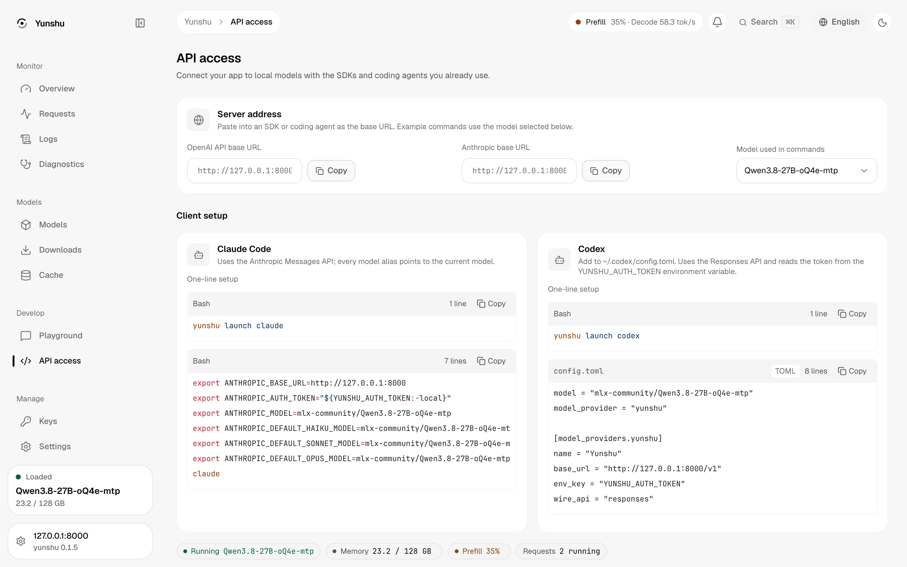
</picture>

### API keys

Create, edit, rotate, disable and delete API keys with scopes, expiry and daily quotas (requests, tokens, concurrency), plus per-key usage over 7, 14 or 30 days. The secret is shown once. See [Authentication and keys](guides/AUTH_AND_KEYS.md).

<picture>
  <source media="(prefers-color-scheme: dark)" srcset="images/console/en/keys-dark.webp">
  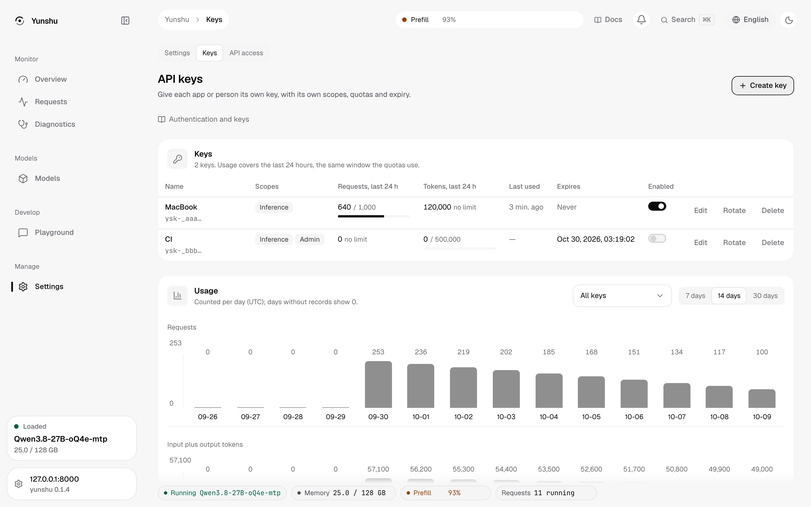
</picture>

### Settings

Engine connection and token, appearance and language (English, Traditional and Simplified Chinese), model idle retention, **effective settings** (every registered `YUNSHU_*` setting with its value, source and when a change applies; edits that need a restart prompt, and a restart happens only under launchd), the launchd service state, network and a **CORS editor**, and keyboard shortcuts.

<picture>
  <source media="(prefers-color-scheme: dark)" srcset="images/console/en/settings-dark.webp">
  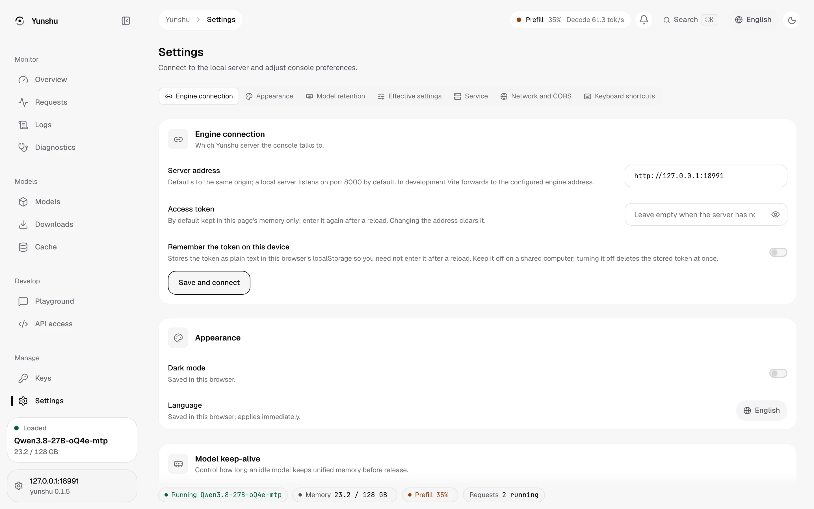
</picture>

## On a phone

The layout reflows below tablet width: the navigation becomes a drawer, cards stack and the status island
becomes a compact pill. Checked in WebKit at 402 px wide.

<p>
  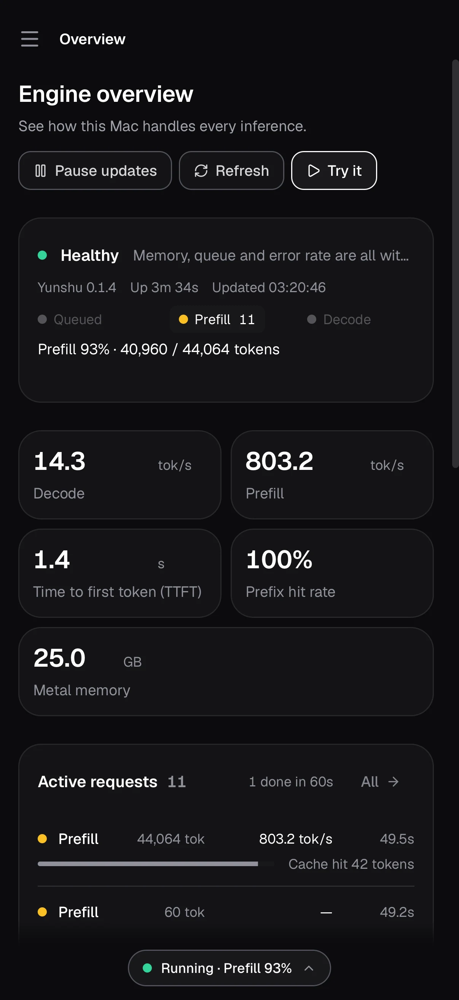
  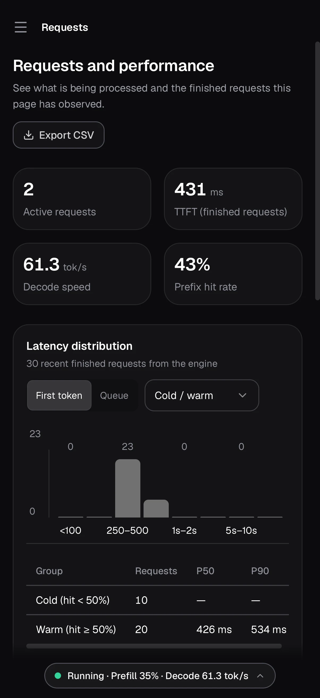
</p>

## What it connects to

Everything the console shows comes from the engine's own routes: `GET /v1/yunshu/status` (every few seconds),
`/v1/yunshu/requests/recent` and `/history`, `/v1/yunshu/host`, `/v1/yunshu/memory`, `/v1/yunshu/cache`,
`/v1/yunshu/logs`, `/v1/yunshu/keys`, `/v1/yunshu/config`, `/v1/yunshu/cors`, `/v1/yunshu/service`, the model
load, unload, warmup and download routes, and the authenticated `/debug/*` diagnostics. See the
[API surface](guides/API_SURFACE.md#single-operator-console-backend). Missing data is shown as unavailable,
never as zero.

## Developing the console

The source is in `frontend/` (Node.js 22.18+, pnpm 11.19.0). A source checkout needs `pnpm install --frozen-lockfile && pnpm build` once to write `console_static/` (a built wheel already contains it); without it `/console/` returns an actionable 404 and the API is unaffected. Run `pnpm dev` in `frontend/` and open `http://127.0.0.1:3971/console/`. Vite proxies the
engine API to `http://127.0.0.1:8000`, or set another server URL in Settings (cross-origin access needs CORS
configured, see [Authentication](guides/AUTH_AND_KEYS.md#cors)).

## Metric meanings

The graph's time selector filters observations collected since opening the page;
no historical values are invented. Throughput plots sample the backend's rolling
mean prefill/decode speed (currently five minutes), not an aggregate of overlapping
request-count windows. The request-count KPI uses `throughput.window_s` (currently
60 seconds). Prefix reuse and TTFT refer to the latest terminal request, not an
all-time mean. Metal active/cache/peak are allocator metrics, not OS free memory or
prefix-cache hit counters. Missing values remain unavailable rather than zero.

## Reproducing the screenshots

The images in `docs/images/console/` are rendered from the real console against route mocks (no engine and
no GPU), so the numbers in them are illustrative fixtures, not measurements:
`node scripts/docs/console_shots.mjs <vite-url> <out-dir>` (see the script header).

## Validation and packaging

```sh
cd frontend
pnpm test
pnpm test:browser  # first run: pnpm exec playwright install chromium webkit
pnpm build
pnpm exec yunui doctor --strict
pnpm exec yunui audit --strict
cd ..
uv run pytest tests/unit/test_console_ui.py -q
```

Build the console before building a wheel; the release workflow checks that `index.html` is in it. Hatch includes generated `console_static`
assets when present; source distributions include the frontend and pinned YunUI
package under `frontend/vendor/`. That package contains the approved YunUI code
without requiring a sibling checkout or an npm release; provenance and checksum are
recorded in `frontend/vendor/README.md`. No release version was changed.

Browser/API fixture checks validate the UI without model inference. Model-backed
acceptance checks on a shared machine belong in `gpuq` / `yv`; see
[verification](guides/VERIFY.md).
