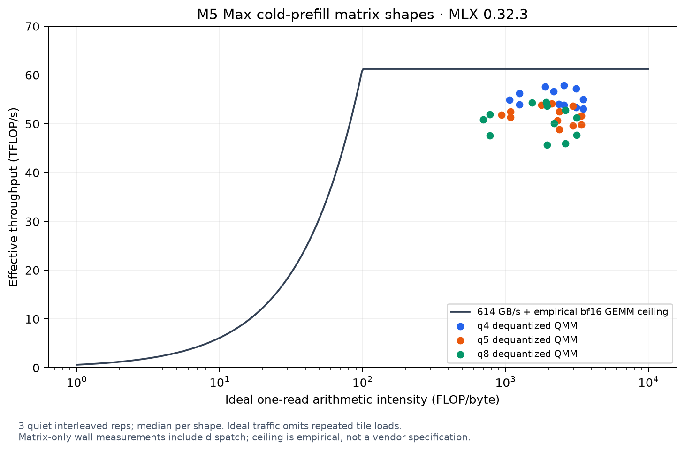

# M5 Max cold-prefill compute investigation

Worker: `codex-naxprefill2` (resumed `codex-naxprefill`); checkpoint: `Jundot/Qwen3.8-27B-oQ4e-mtp`.
This investigation covers compute only. Restore and APC implementation belong
to the prefill lead and are not modified here.

## Hardware ceiling and FLOP accounting

The measured machine reports `Apple M5 Max`, `applegpu_g17s`, 128 GiB memory,
and a 107.5 GiB recommended GPU working set. Apple specifies up to 40 GPU cores
and 614 GB/s memory bandwidth for M5 Max. Each GPU core has a Neural Accelerator;
this is separate from the 16-core Neural Engine. Apple publishes relative peak
AI compute improvements, not an absolute fp16/bf16/int8 TFLOP/s specification in
the sources below. Microbench throughput is an empirical lower bound on the
compute ceiling, not a vendor peak specification.

- [Apple M5 Pro / Max announcement](https://www.apple.com/uk/newsroom/2026/03/apple-debuts-m5-pro-and-m5-max-to-supercharge-the-most-demanding-pro-workflows/)
- [Apple MLX / M5 explanation](https://machinelearning.apple.com/research/exploring-llms-mlx-m5)
- [Apple Neural Accelerator / TensorOps technical talk](https://developer.apple.com/videos/play/tech-talks/111432/)

CPU inspection of safetensors headers and per-module quantization overrides:

| Target projection family | Weight elements | Packed weight bytes |
|---|---:|---:|
| MLP | 17,112,760,320 | 8,857,190,400 |
| GDN projections | 5,560,074,240 | 3,053,230,080 |
| Attention projections | 1,677,721,600 | 867,696,640 |
| Total | 24,350,556,160 | 12,778,117,120 |

There are 64 layers: 48 GDN and 16 full-attention layers, with no MoE. Several
projections use 5 bits; an all-q4 benchmark alone does not represent oQ4e.
Projection work is 48.7011 GFLOP/token. It excludes embedding lookup, the final
single-row LM head, vision/MTP weights, norms, convolution and GDN recurrence.
The causal attention estimate counts QK and PV with triangular work, 24 query
heads of dimension 256 in each full-attention layer.

| Context | Projection work (TFLOP) | Causal QK+PV work (TFLOP) |
|---|---:|---:|
| 8,192 | 398.96 | 13.19 |
| 32,768 | 1,595.84 | 211.11 |

Thus `2 * 27B * tokens / TTFT` overcounts projection work (embedding/other
weights) and omits attention work. Attention rises from about 3.2% to 11.7% of
this counted work between 8K and 32K. This is a FLOP estimate, not a measured
time share. At M=2048, a q4 up projection has roughly 2,564 FLOP/byte when
counting packed weights, scales/biases, input and output once; repeated tile
loads and layout conversion increase real traffic. It is firmly above the
~100 FLOP/byte balance implied by a 60 TFLOP/s empirical ceiling and 614 GB/s.

Raw inventory: `/Volumes/P5Plus/yunshu-build/codex/nax-checkpoint-roofline.json`.

Empirical roofline (`1003-142848-00-nax-roofline-v2-1430`, rc0, complete, quiet;
three interleaved repetitions, highest per-shape median):

| Effective TFLOP/s | fp16 | bf16 |
|---|---:|---:|
| Dense GEMM | 61.22 | 61.24 |
| Affine q4 dequantized QMM | 57.54 | 57.85 |
| Affine q5 dequantized QMM | 54.19 | 54.10 |
| Affine q8 dequantized QMM | 54.05 | 54.46 |

For the 2048x17408x5120 down projection, bf16 q4/q5 QMM medians were
53.82/48.89 TFLOP/s. Transient dequant+GEMM was 48.96/51.68 respectively:
it loses on q4 and has a small matrix-only advantage on q5. Dequant+GEMM
is not uniformly bit-equal: 18 of 72 dtype/shape/bit cases differed, with
maximum observed absolute differences 0.00012207 (fp16) or 0.00097656 (bf16)
in this synthetic input range. It is not installed as a serving default.

`1003-144757-00-nax-tiles-1449` (rc0, complete, quiet, three interleaved reps)
tested native QMM tile geometry while holding BK=64. All 48 q4 tile comparisons
were bit-equal. At M=2048, up projection q4/native64x64/128x64 were
58.00/58.03/60.71 TFLOP/s; down was 53.89/54.26/55.20. BN=128 loses badly.
At M=8192 with K=17408, BM128 also loses (47.86 vs stock 53.74), so a blanket
larger-tile policy would be wrong. These are matrix results, not HTTP TTFT.

## Engagement in the real model

`1003-144757-00-nax-layout-27b-1449` captured actual layer 0 (GDN) and layer 3
(attention) calls on the checkpoint, using 2048 rows. The captures contain:

- `affine_qmm_t_nax_bfloat16_t_gs_64_b_4_bm64_bn64_bk64_wm2_wn2_alN_true_batch_0`
- the corresponding `_b_5_` QMM function
- `gated_delta_fused_nax_bfloat16_t_128_128_16_48_16`
- `steel_attention_dsplit_bfloat16_bq64_bk32_bd256_bv256_wm4_wn2_maskbfloat16_align_Q_t_align_K_t_has_mask_n_do_causal_t_has_sinks_n`

The last name lacks the word `nax`, but is generated by
`sdpa_full_self_attention_nax`, through `get_steel_attention_nax_kernel`.
Thus all three main compute paths already engage NAX; this does not establish
a percentage of Neural Accelerator utilization. Full Xcode counter analysis
is unavailable in the installed Command Line Tools.

Capture receipts: `/Volumes/P5Plus/yunshu-build/codex/nax-capture-engagement.json`
and `nax-capture-kernels.json`. The captures included resident model buffers
(about 17 GiB each) and were deleted after inspection, as required.

## MLX dispatch, checked against the installed version

Installed MLX is 0.32.3. The reference checkout is `v0.32.3-30-g0840c42a`;
dispatch conditions were also read from the exact `v0.32.3` tag. Experiments
consume the installed headers, avoiding source assumptions from later commits.

- `device.cpp:is_nax_available`: macOS >=26.2 plus GPU generation >=17 for the
  `s` architecture (>=18 for `p`); `MLX_METAL_NO_NAX` disables the compiled path.
- `QuantizedMatmul::eval_gpu` first applies its vector threshold. Non-batched
  transposed matrix products enter `qmm_splitk`; it targets about 512
  threadgroups using 32x32 tiles. When split_k >1, this SIMD split-K path can
  bypass NAX even on M5. With split_k <=1, it forwards to `qmm`.
- `qmm` chooses NAX when K is divisible by 64, transpose is true (or mode is
  affine with N divisible by 64), and the input is not float32 unless TF32 is
  enabled. Standard large transposed prefill QMM uses BM=BN=BK=64, WM=WN=2.
  The 32-row specialization is restricted to M<=32.
- NAX QMM accepts the supported affine 2/3/4/5/6/8-bit layouts. It dequantizes
  into the activation type in threadgroup memory and accumulates in float32.
  q4/q8 effective TFLOP/s here measures this floating-point dequantized matmul,
  not the hardware's native integer-only TOPS ceiling.
- Dense `matmul.cpp` selects Steel NAX for non-complex input, with the same
  float32/TF32 restriction. Small shape specializations remain separate.
- `gather_qmm` selects NAX for transposed, K%64==0 input with the dtype rule;
  sorted RHS gather has its own dispatch conditions and NAX kernel. The dense
  27B target has no MoE routing, so gather_qmm is not its projection path.
- `mx.fast.gated_delta_update` defaults to internal chunk size 16 on NAX GPUs
  for T>8. Size 16 selects `gated_delta_fused_nax_*`; size 8 uses the alternate
  chunked kernel. Increasing the engine's 2048-token span does not increase
  this internal 16-token chunk. Arbitrary internal sizes are not supported.
- Full SDPA supports NAX at head dimensions 64/96/128/256/512 with the dtype
  rule. For head dimension 256, query length >=1024 and causal/array masking
  avoid the fallback and select the split-head NAX kernel. This covers normal
  2048-row target prefill, but is not a claim about short suffixes/decode.

Yunshu's `LaneLinear.__call__` routes rows >512 to stock QMM; narrow projections
below 256 outputs remain lane kernels. Consequently its normal large target
projections already qualify for NAX. The installed GDN patch routes spans >=64
to `mx.fast.gated_delta_update`. Stock-layout untiling and scales/biases
deinterleaving remain additional work around QMM.

Installed quantized NAX header SHA256:
`1a9197c4afaec8dddc869165a4328f712c7b69d3a3a946e9cafe6ddebc456027`.

## Measurement design

`nax_prefill_probe.py --dry-run` validates arguments before importing MLX.
Microbench graphs use explicit GPU arrays; ten graphs are built outside the
timed interval, then evaluated with one host fence. Timing still includes
dispatch/evaluation overhead and is not a GPU counter measurement. Arms and
three repetitions are interleaved. Quantized, transient dequant+GEMM and
resident dequant+GEMM are distinguished; numerical equality is recorded.

Model probes evaluate both hidden outputs and caches. The older
`prefill_profile.run_chunks` evaluated caches alone, allowing MLX's lazy graph
to prune the final MLP/norm. This measurement bug is fixed and has a regression
test. Per-class synchronization changes the execution schedule, so class
timings must not be reported as HTTP TTFT. Plain model forwards also omit
gateway, tokenization, final head and first-token dispatch.

The tile prototype reuses installed MLX QMM helper arithmetic, holds BK=64
fixed, and tests BM/BN changes only. The initial sweep is research code; the proven direct-loader variant is now
connected to serving under the guards below. Layout-retention arms use exactly the same packed weights and QMM;
they bound the benefit of eliminating repeated layout work. Prebuilding their
layouts before a plain model timing is a compute ceiling experiment; HTTP
cold requests must include the first construction cost.

GPU jobs, completed results and decisions are recorded in the worker report
and harvest JSON. Only a shipped, measured serving improvement belongs in
`PERF_TREND.md`.

## Fine operation breakdown and the measured candidate

`1003-171419-00-nax-phase2-quiet-1715` finished rc0 with all four arm outputs
complete and `contended=false` (foreign CPU max 238.7%, threshold 1620%). Its
2048-row classified forward took 2.476 s with per-op fences. Resolving lazy
inputs and splitting nested timers gives:

| Class | Seconds per 2048-row forward | Projection TFLOP/s |
|---|---:|---:|
| MLP gate/up | 0.834 | 56.02 |
| MLP down | 0.465 | 50.23 |
| GDN input projections (including narrow gates) | 0.350 | 47.46 |
| GDN output projection | 0.126 | 49.00 |
| Attention QKV | 0.097 | 49.56 |
| Attention output | 0.041 | 50.59 |
| All stock layout restoration | 0.228 | — |
| Native chunked GDN core | 0.066 | — |
| Layer norms + GDN QK/gated norms | 0.056 | — |
| SDPA | 0.025 | — |
| GDN convolution | 0.016 | — |
| GDN gates/cache preparation | 0.010 | — |

The remaining time is unclassified producers and host/fence overhead. These
times explain classes, not HTTP TTFT; their synchronization schedule differs
from the plain forward. In particular, the earlier coarse GDN timer included
lazy convolution/normalization producers and must not be called pure core time.

The candidate reads the existing lane layout directly, including the paired
group-major scales/biases, and reuses MLX's native dequantizer, NAX tile MAC,
K loop, float32 accumulation and output conversion. It uses BM128/BN64/BK64,
with BM64 retained for M>4096 and K>8192. The complementary narrow gate arm
uses the existing lane kernel with its original 32-row arithmetic block and
one full aligned prefill span instead of 128-row pieces. No extra resident
weight layout is needed.

Three interleaved plain forwards (same job, 2048-row spans):

| Median forward seconds | Stock | Tile128, stock layout | Direct loader | Narrow only | Combined |
|---|---:|---:|---:|---:|---:|
| 8K | 8.317 | 8.242 | 7.694 | 8.550 | 7.657 |
| 32K | 38.035 | 36.187 | 34.747 | 37.104 | 34.591 |

All candidate hidden outputs and complete native cache arrays are bit-equal to
stock, with explicit engaged-call counters (400 wide /96 narrow projections
per complete span). Baseline runs show some variance despite clean CPU
admission; final adoption depends on HTTP pairs and correctness gates.

`1003-180051-00-nax-http-paired-1800` finished rc0 + complete, quiet, foreign
CPU max 158.1%, threshold 1620%. Three balanced independent server sessions per
context/arm, greedy 256 output tokens, MTP explicitly engaged, cold cached=0:

| Cold HTTP TTFT median ms | Main baseline | Combined candidate | Historical TensorFold |
|---|---:|---:|---:|
| 8K prose | 8451 | 7793 | 8396 |
| 8K code | 8453 | 7784 | 8399 |
| 32K prose | 36934 | 34334 | 39035 |
| 32K code | 36959 | 34359 | 39098 |

Every paired request hash and complete response digest is identical. Server
logs show real candidate dispatch and MTP. TF values are the earlier
`PERF_TREND.md` measurements, with DFlash2, not a new simultaneous TF run.
The first 8K prose candidate session was 8546 ms versus stock 8451 ms; later
pairs saved 7.65/8.97%. Thus its first cold shader-compilation cost is visible
and must not be hidden by the median. All three 8K code pairs save 7.86–8.82%;
32K prose pairs save 6.96–7.80%, code 7.03–9.18%. The prepared serving module
can compile its tiny tile variants during model setup to move that one-time
cost before readiness; this setup cost remains part of model loading.

Raw summaries: `nax-phase2-model-summary.json`, `nax-http-paired-summary.json`
under `/Volumes/P5Plus/yunshu-build/codex`. The production module is prepared
with fail-closed version/device/shape checks and a source-hashed arithmetic ID;
it is connected to serving after the paired accuracy and APC identity gates.

## Production validation and scope

The loader is enabled only for MLX 0.32.3 on the measured Apple M5 Max,
with GPU generation 17/18 checked through the same parser as the invariant
backend, and the 5120-hidden/64-layer quantized target. M1–M4 retain main
portable kernels. Unknown devices, versions and unsupported shapes keep
stock QMM. Accepted spans have 512<M<=8192 and M%128==0; wide projections
require tiled group-64 weights, K%64==0, N%64==0, and 4/5/8 bits.
Decode/verify use the existing bounded lane path. The round driver is excluded.

The native headers and loader are hashed into the existing prefill arithmetic
ID, which already contributes to the APC key. No APC or restore implementation
was edited. Tiny tile warmup occurs before model readiness; its compilation
cost is model setup cost. No extra full weight representation is retained.

`1003-192610-00-nax-quality200-aligned-1925`: M5, rc0, complete, 200 arithmetic
questions with neutral long-context padding, baseline/candidate 200/200,
zero different raw token IDs or per-token logprobs, 496 candidate dispatches
per item. This modest gate does not establish accuracy on a broad benchmark.
The research and production loaders use identical generated Metal arithmetic.

`1003-213959-00-nax-production-identity-2140`: M5, rc0 and successful complete;
8K/32K prose/code, suffix/chat, cold versus genuine partial/full APC hits.
Every token and logprob is bit-equal (max_abs_dlp=0). All 16 server logs
confirm MTP and NAX prefill engagement.

`1003-212558-00-nax-final-http-2125`: M5, rc0, successful complete, quiet,
foreign CPU max 210.21% (1620% threshold). Three balanced independent server
sessions per arm/context, 256 output tokens, cached=0, identical request hashes
and response digests; all 12 logs confirm MTP and all 6 candidate logs NAX.

| Cold HTTP TTFT median ms | Baseline | Production | Reduction | Historical TF |
|---|---:|---:|---:|---:|
| 8K prose | 8547 | 7765 | 9.15% | 8396 |
| 8K code | 8432 | 7788 | 7.64% | 8399 |
| 32K prose | 36806 | 34105 | 7.34% | 39035 |
| 32K code | 36651 | 34134 | 6.87% | 39098 |

TF remains the historical DFlash2 comparison from PERF_TREND, not a new TF
run. These measurements precede the final merge from main 2830fff1; the
post-merge measurements and gate results follow below. The baseline launcher
disables only this NAX integration in the same merged tree, retaining main
stock QMM and its invariant lane dispatch; it is not a separate checkout.

## Own ideas and negative results

The concrete contribution is a layout bridge: feed existing lane-tiled packed
weights and paired scale/bias planes directly into native NAX arithmetic.
It removes layout reconstruction without keeping a second resident checkpoint.
The same-row-block narrow prefill extension is deliberately limited rather
than widening the generic lane API. Tile tuning is a small part of the combined
win; the isolated 8K tile-only plain forward gain was about 0.9%, not a standalone
HTTP claim.

Transient dequant-to-GEMM was neither uniformly faster nor bit-equal, and was
not adopted. BN128 and blanket BM128 were rejected by M5 tile measurements.
Narrow-only timings were mixed, so no standalone narrow speed claim is made.
GDN and attention already select native NAX: no additional GDN/attention/norm
change is shipped. A future norm-to-loader fusion must preserve each original
bf16 rounding boundary; its cheapest decisive test is a single-layer paired
output/state comparison before whole-model timing. It remains unimplemented.

## Final main integration gates

Main 2830fff1 was merged once in this resumed run (5b542a24), retaining M1–M4
portable invariant kernels and the M5 fragments. The only shared lane_qmm
extension is the bounded long-narrow prefill entry (6 additions/2 deletions);
VLM setup has 18 cold-compute integration lines. Restore/APC implementation
is untouched.

`1004-005400-00-nax-merged-identity-0059`: explicitly device=m5, rc0, successful
complete, clean, foreign CPU max 183.1%; all eight cases retain genuine
partial/full APC hits and bit-equal token IDs/logprobs (max_abs_dlp=0).
All 16 logs confirm NAX and MTP engagement. M5 full unit suite: 8679 passed,
20 skipped, 12 warnings in 324.84s; focused 26 passed; ruff check/format pass;
mypy no new errors (897 baseline). No worktree venv was created.

The additional post-merge quiet HTTP repeat
`1004-005443-00-nax-merged-http-0101` was cancelled before it started after
waiting for a queue slot; there is no output or new timing claim. CPU source
comparison confirms that main 2830fff1 selects the exact same M5 `_MAIN`,
`_COOP`, `NIBBLES` and `BYTES` shader strings as the measured 1bddf9a2 baseline.
The runner, scheduler and GDN prefill files also have no intervening changes.
This source comparison is not substituted for a timing measurement: the table
above remains the measured pre-merge three-repetition A/B, and post-merge
correctness is established by the explicit M5 identity job.

All 34 inherited/resumed jobs were harvested (20 done rc0, 7 failed rc1, 7
cancelled; no pending/running). Full job IDs, rc, output complete records and
log tails: `/Volumes/P5Plus/yunshu-build/codex/naxprefill2-harvest.json`; wrapper
children: `naxprefill2-child-harvest.json`. Known failed initial arms were
kept as failures: Metal buffer-address rewrite, reused capture path, HTTP
shutdown receipt, misaligned quality prompt, and tiny partial/spec assumptions.
Their corrected replacements passed; no failed wrapper is called successful.
Inspected Metal traces were deleted. Final document/private-research checks:
19 passed, and git diff --check passed.
